# Summary

This readme provides the detail steps of operator installation on Openshift 4. It covers installation on Openshift web Console and CLI. It also provides a [Troubleshooting](#troubleshooting) section

For more details regarding Operator Lifecycle see, https://docs.openshift.com/container-platform/4.2/operators/olm-what-operators-are.html

After completing this tutorial you should be able to

- Install Operator fronm OperatorHub.
- Install Operator via Operator SDK CLI
- How to use Openshift quay.io registry
- Do installation troubleshooting

### Install Operator in Openshift 4 console
Since Openshift4.1, red hat introduced the Operator concept. A list of pre-pacakaged operators can be discovered in OperatorHub.

#### 1. Login to Openshift with admin role
You can access to Openshift cluster web console via directly url or access it from Openshift cluster dashboard on IBM Cloud console. From left menu, navigate to OperatorHub

Checkpoint: view OperatorHub
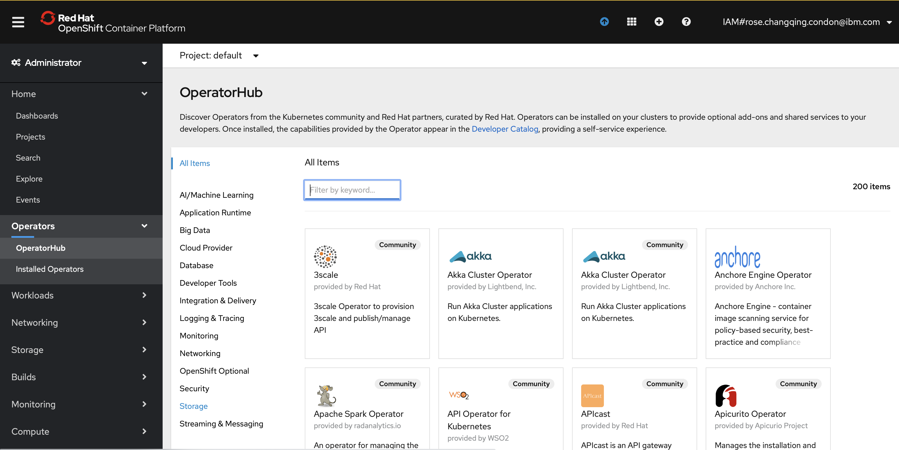

#### 2. View avaialble operators
You can search name by enter text in filter box on console, or view avaialble operators with oc command

Checkpoint: view Operator list via oc
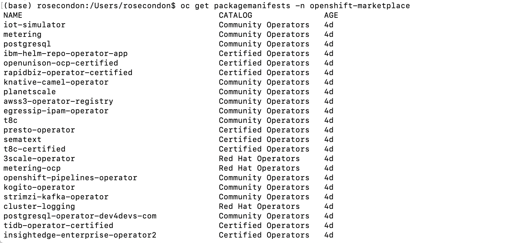

#### 3. Search and select Operator, then install
You will need to subscribt for installation

Checkpoint: installation subscript
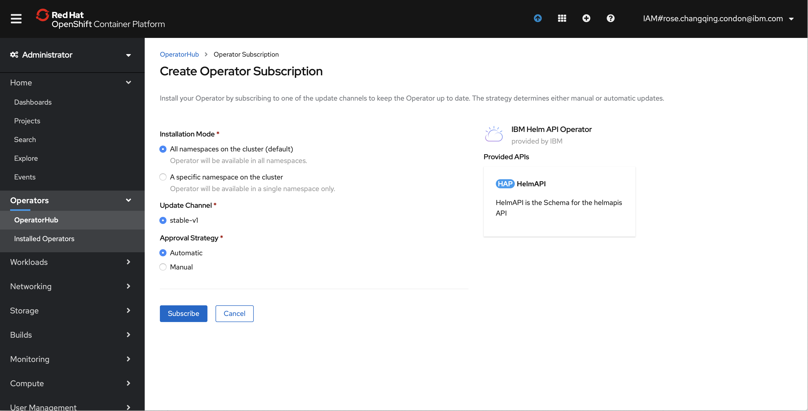

#### 4. Create an instance
In order to use it, you will need to create an instance for deployment 

Checkpoint: instance
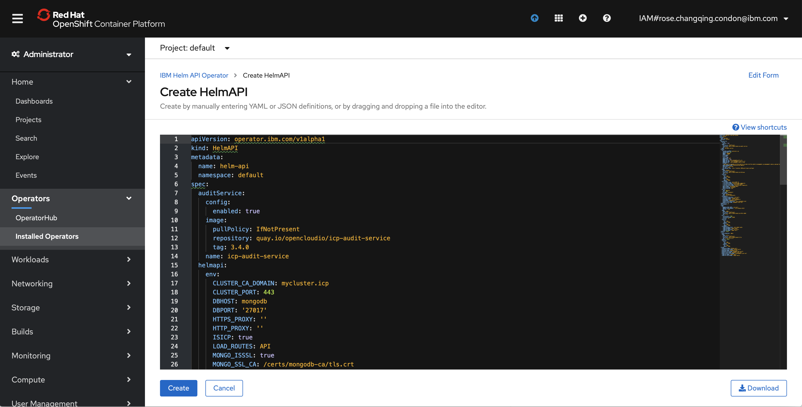

#### 5. Verify the pod status
Ensure deployment is error-free, and view the pod status 

Checkpoint: pod status
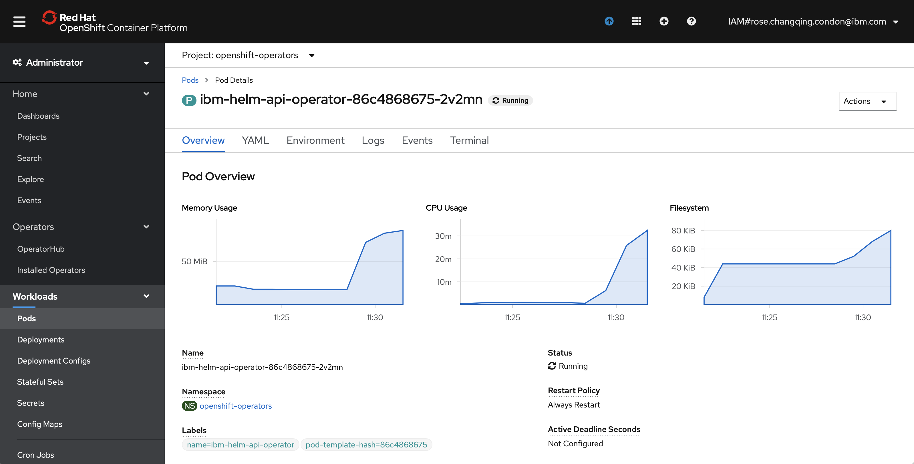

#### 6. View the all installed operators
At this point, the installed operators should be ready to use

Checkpoint: deployment status
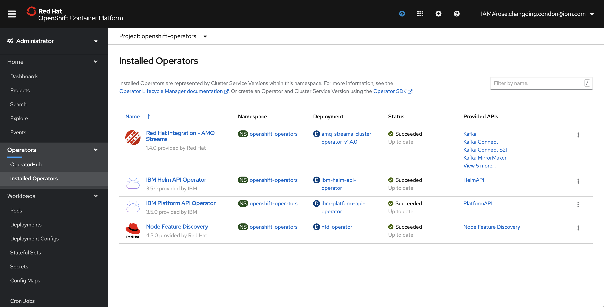

#### 7. View pod status of all installed operators
Make sure the pods are up and running

Checkpoint: pod status
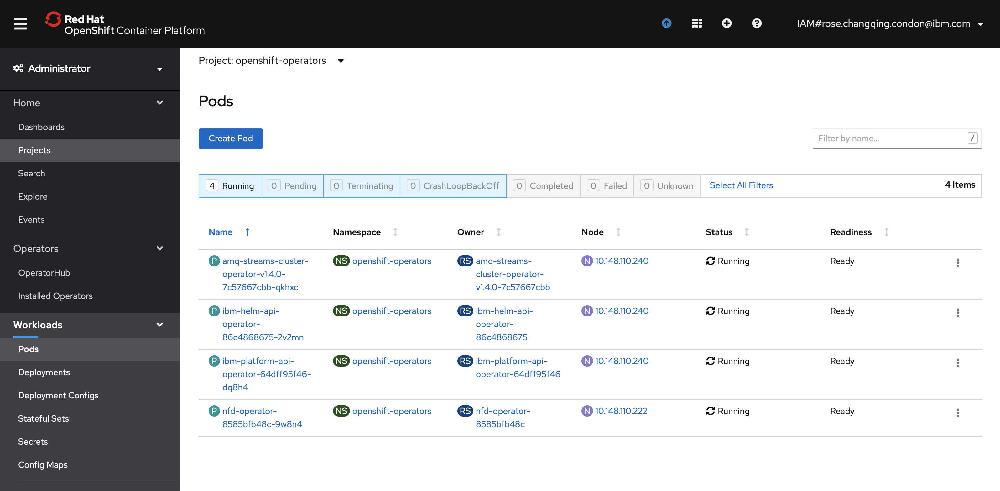

### Install Operator in Openshift 4 via CLI
Althrough there is a list operators are exiating in the OperatorHUb, however there are some crutial operators are not avialble on OperatorHUb. In this case, install operator via CLI is an option.
You can visit <a href="https://docs.openshift.com/container-platform/4.2/operators/olm-what-operators-are.html" target="_blank">Openshift 4 doc </a> for more details.

#### 1. Preparation Operator SDK
Installl Operator SDK CLI. View <a href="https://docs.openshift.com/container-platform/4.3/operators/operator_sdk/osdk-getting-started.html" target="_blank">Openshift 4 doc </a> for more details.

Install SDK using brew (Mac user)
```
brew install operator-sdk
```
Checkpoint: Install SDK and sdk version
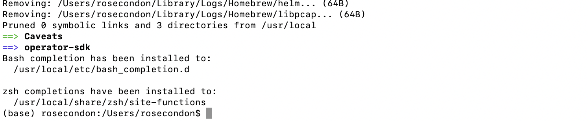

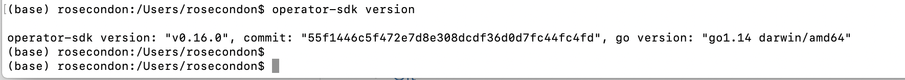

#### 2. Create new Go Project for operator using SDK
Precheck: If you don't have go compiler, download and install <a href="https://golang.org/doc/install" target="_blank"> Go compiler </a>. Then create new Go-base Project for new operator - memory cache

Checkpoint: steps
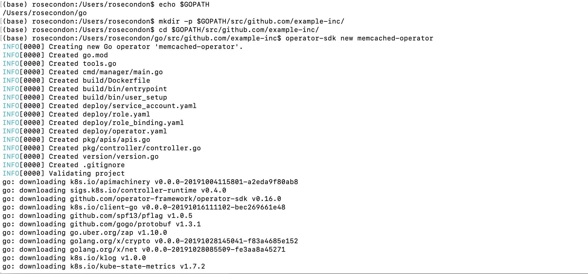

#### 3. view new Go Project
Once create new project completed, check the status

Checkpoint: check project status
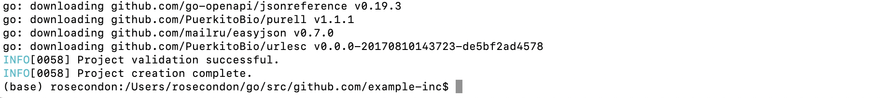

#### 4. Add Custom Resource Definition
Use the CLI to add a new CRD Api

Checkpoint: view cli command and check result
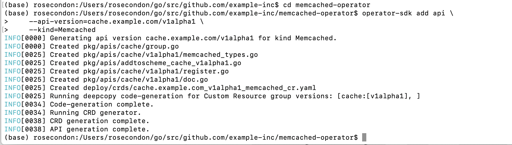

#### 5. Add spec and status to Custom Resource Definition
The spec and status are for operator deployment.

Checkpoint: view cli command and check result
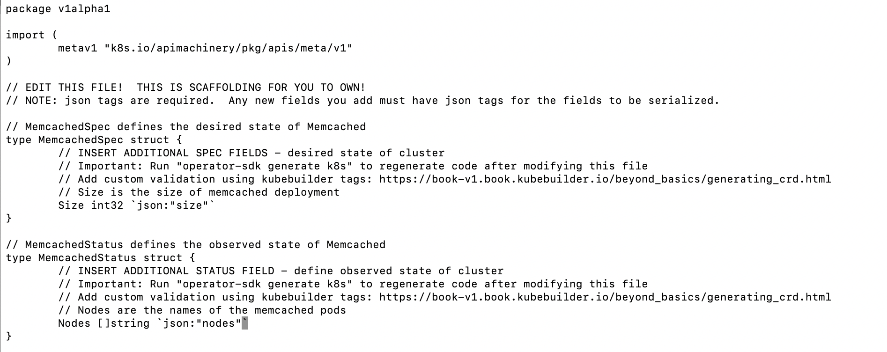

#### 6. Update resource type using sdk cli
Since we modify the go source code (memcached_types.go), will need to run sdk to update the resource type.

Checkpoint: view cli command and check result
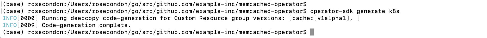

#### 7. Add a new Controller
Controller description

Checkpoint: create a new controller and view the deployment yaml
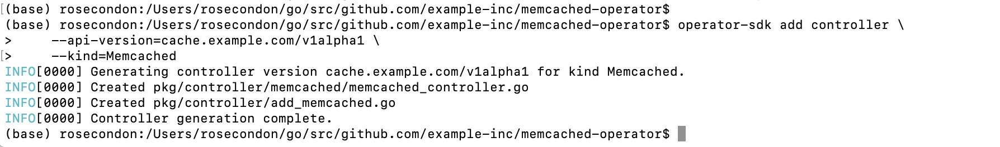

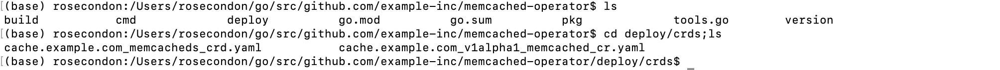

#### 8. Build and run operator
We will do the deployment inside a Openshift cluster
> First, register CRD with the Kubernetes apiserver using SDK CLI
```
oc create -f deploy/crds/cache.example.com_memcacheds_crd.yaml
```
Checkpoint: you should see confirmation message 
##### customresourcedefinition.apiextensions.k8s.io/memcacheds.cache.example.com created

> Build operator image.
Pre-check: Here we are using openshift quay.io. Create one if you don't have, and setup the cretential.

Checkpoint: view cli command and check result
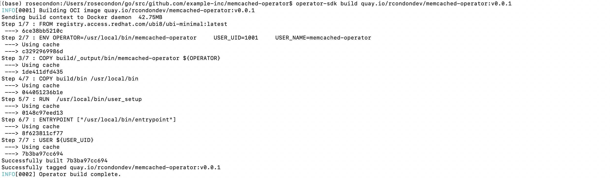

> Update the deployment image value for deploy/operator.yaml.
Replace "REPLACE_IMAGE" with actual value using preferred editor. You may either use "sed -i" command or any preferred editor. Here is example of sed command

```
sed -i "" 's|REPLACE_IMAGE|quay.io/rcondondev/memcached-operator:v0.0.1|g' deploy/operator.yaml
```

> Push build image to quay.io registry
Checkpoint: check command result and image on quay.io dashboard

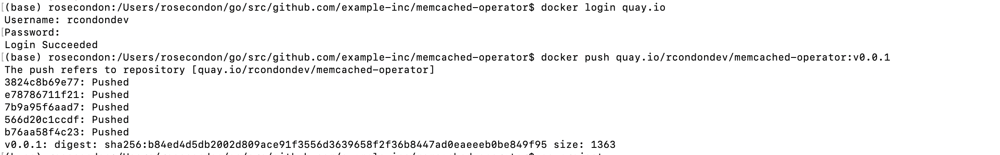

View image on quay.io dashboard
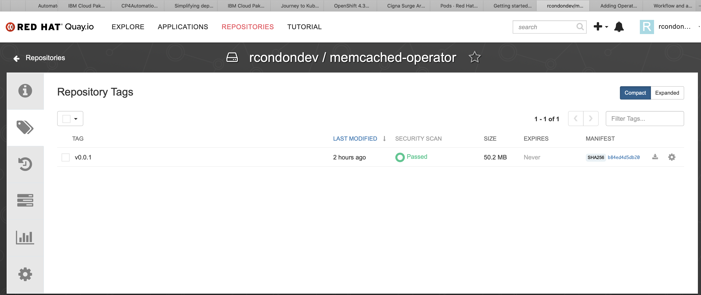

> Deploy

Checkpoint: view cli command and check result
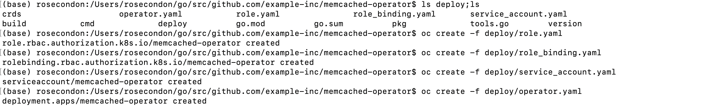

#### 9. View deployment status
> Using CLI
Checkpoint: view cli command and check result
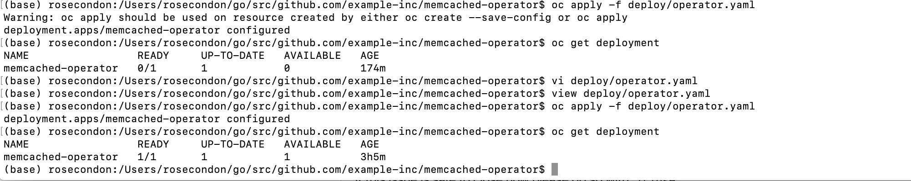

> Using Openshift web console
Checkpoint: view cli command and check result
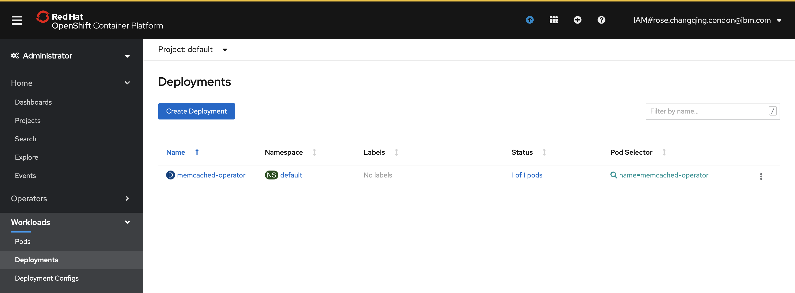

#### 10. View operator pod status
Make sure the new installed operator pod is up and running
Checkpoint: view pod status on console
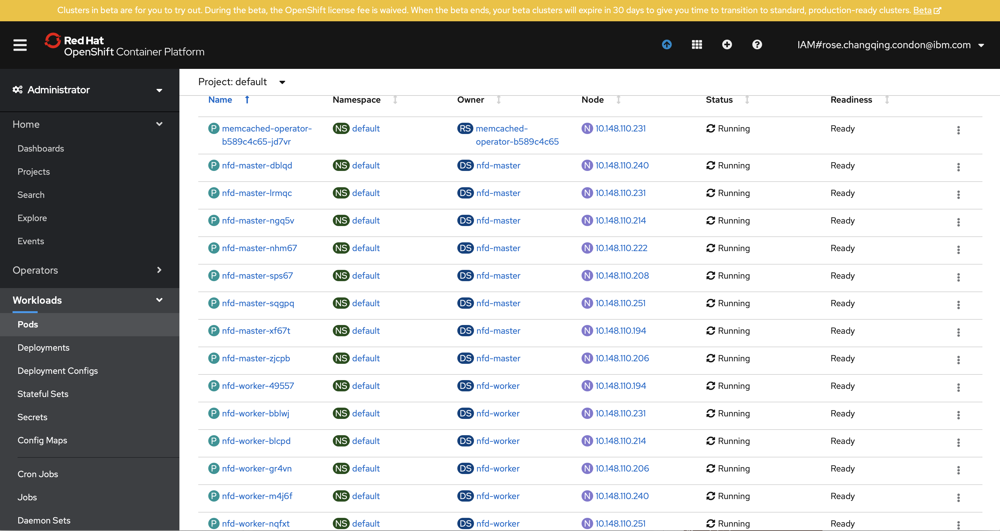

### Troubleshooting
Troubleshooting
